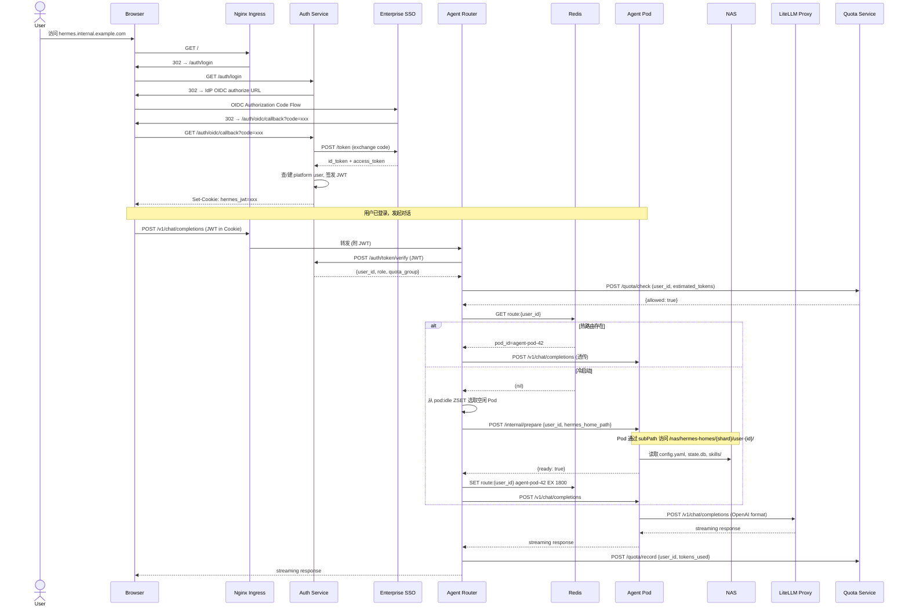
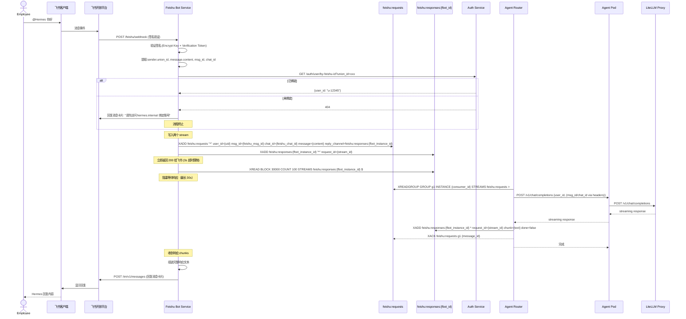
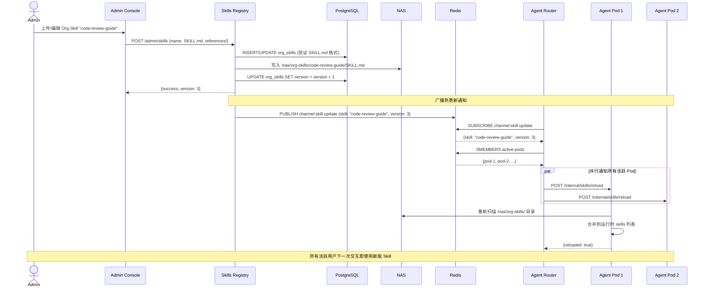
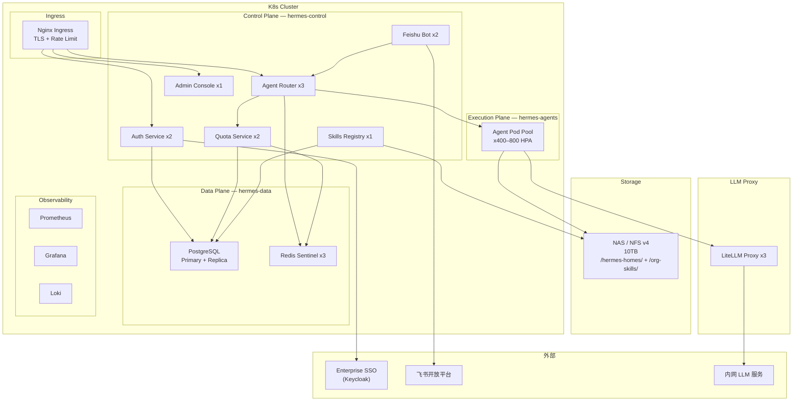

# Arch Design — Hermes Agent 企业内部 SaaS 平台

**版本**: 0.2-reviewed
**日期**: 2026-04-16
**状态**: design-swarm
**主责角色**: architect
**Slug**: hermes-enterprise-saas
**关联 PRD**: `docs/artifacts/2026-04-15-hermes-enterprise-saas/prd.md`

> **更新（2026-04-16）**：经执行团队质疑后确认了 BE-2（Pod 容器级切换）、BE-3（Redis Streams reply_channel）、DO-1（NFS Subdir External Provisioner）三个方案，已同步更新。

---

## 结论先行

将开源单用户 Hermes Agent 改造为 20,000+ 用户的企业内部 SaaS 平台，核心设计决策是 **"不改 Agent 内核，在外围加控制面"**：

1. **Agent Pool + 热冷分离**：600 个 Agent Pod 共享池，通过 Redis 路由表实现用户与 Pod 的动态绑定，空闲 30 分钟自动回收。
2. **Per-user HERMES_HOME on NAS**：保留 Hermes 原生的单用户文件结构（SQLite + config + skills + memory），每用户一个 NAS 子目录，通过 hostPath subPath 挂载。
3. **平台控制面新建**：Auth / Router / Quota / Feishu Bot / Skills Registry / Admin 全部新建，FastAPI + PostgreSQL 技术栈。
4. **Hermes 代码改动最小化**：仅需 `API_SERVER_HOST` 支持 `0.0.0.0` 绑定（已有 env var 支持）、禁用 Web UI 直接访问（由平台代理）。

---

## 1. 系统边界

### 1.1 边界内（本平台负责）

| 组件 | 说明 |
|------|------|
| Platform Control Plane | Auth Service, Agent Router, Quota Service, Admin Console |
| Agent Execution Layer | Hermes Agent Pod Pool (K8s Deployment) |
| Feishu Bot Service | 飞书 Webhook/WebSocket 接收与消息推送 |
| Skills Registry | 组织级 Skills 发布、同步、版本管理 |
| Web Portal Gateway | Nginx 反向代理 + SSO 登录页 |
| Data Cleanup Job | K8s CronJob，3 个月过期数据归档/删除 |

### 1.2 边界外（外部依赖）

| 依赖 | 类型 | 集成方式 | 假设 |
|------|------|---------|------|
| 企业 SSO / IdP | 外部服务 | OIDC Authorization Code Flow | D1: Keycloak |
| 飞书开放平台 | 外部 SaaS | Webhook + REST API (lark_oapi SDK) | D2: 企业自建应用 |
| 内网 LLM 服务 | 内部服务 | OpenAI-compatible API via LiteLLM Proxy | D3: 若干模型可用 |
| K8s 集群 | 基础设施 | kubectl / Helm | D4: 200 core / 800GB RAM |
| NAS / NFS v4 | 基础设施 | NFS Subdir External Provisioner + StorageClass `nfs-hermes-per-user`，每用户独立 PVC | D5: 10TB 可用 |
| PostgreSQL | 基础设施 | 云托管或自建，单实例 + 流复制 | 内网已有 |
| Redis | 基础设施 | 云托管或自建，Sentinel 模式 | 内网已有 |
| 内网 DNS | 基础设施 | A 记录指向 Ingress | D6: hermes.internal.example.com |

### 1.3 集成点清单

```
┌────────────────────┐
│   外部系统          │
│                    │
│  ┌──────────────┐  │    OIDC Authorization Code Flow
│  │ Enterprise   │──┼──────────────────────────────────┐
│  │ SSO (IdP)    │  │                                  │
│  └──────────────┘  │                                  ▼
│                    │                          ┌──────────────┐
│  ┌──────────────┐  │    Webhook + REST API    │              │
│  │ Feishu Open  │──┼─────────────────────────▶│  Platform    │
│  │ Platform     │  │                          │  Control     │
│  └──────────────┘  │                          │  Plane       │
│                    │                          │              │
│  ┌──────────────┐  │    OpenAI-compat API     │              │
│  │ Intranet LLM │◀─┼─────────────────────────│              │
│  │ (via LiteLLM)│  │                          └──────────────┘
│  └──────────────┘  │
│                    │
│  ┌──────────────┐  │    NFS v4 mount
│  │ NAS Storage  │◀─┼──────────────────────────── Agent Pods
│  └──────────────┘  │
└────────────────────┘
```

---

## 2. 组件拆分

### 2.1 Auth Service

| 属性 | 值 |
|------|-----|
| 职责 | SSO/OIDC 集成、JWT 签发与验证、用户 CRUD、RBAC（admin/power_user/user）、API Token 管理 |
| 技术选型 | FastAPI + PostgreSQL + python-jose (JWT) |
| 新建/复用 | **新建** |
| 副本数 | 2（高可用） |
| 关键接口 | `POST /auth/oidc/callback`, `POST /auth/token/verify`, `GET /auth/user/me`, `POST /admin/users`, `POST /auth/api-tokens` |

### 2.2 Agent Router

| 属性 | 值 |
|------|-----|
| 职责 | 用户请求 → Agent Pod 路由调度、Redis 路由表管理、Pod 健康检查、冷启动触发、会话亲和 |
| 技术选型 | FastAPI + Redis + K8s API (kubernetes-client-python) |
| 新建/复用 | **新建** |
| 副本数 | 3（核心路径高可用） |
| 关键接口 | `POST /v1/chat/completions` (代理转发), `POST /v1/responses` (代理转发), `GET /internal/health`, `POST /internal/route` |

### 2.3 Feishu Bot Service

| 属性 | 值 |
|------|-----|
| 职责 | 飞书 Webhook 签名验证、消息接收/推送、feishu_union_id → platform_user_id 映射、消息卡片渲染 |
| 技术选型 | FastAPI + lark_oapi SDK + Redis Streams (消息缓冲) |
| 新建/复用 | **新建**（复用 Hermes `gateway/platforms/feishu.py` 中的消息格式化逻辑和 lark_oapi 集成模式） |
| 副本数 | 2 |
| 关键接口 | `POST /feishu/webhook` (飞书回调), `POST /feishu/event` (事件订阅) |

### 2.4 Skills Registry

| 属性 | 值 |
|------|-----|
| 职责 | 组织级 Skills 的 CRUD、版本管理、NAS 目录同步、活跃 Agent 热更新通知 |
| 技术选型 | FastAPI + PostgreSQL + NAS (org-skills 共享目录) |
| 新建/复用 | **新建**（复用 Hermes SKILL.md 格式规范和 manifest 机制） |
| 副本数 | 1（写入低频） |
| 关键接口 | `POST /admin/skills`, `PUT /admin/skills/{id}`, `GET /skills/list`, `POST /internal/skills/notify-update` |

### 2.5 Quota Service

| 属性 | 值 |
|------|-----|
| 职责 | Per-user token 用量计量、每日配额检查、超限拒绝、LiteLLM callback 接收用量数据 |
| 技术选型 | FastAPI + PostgreSQL + Redis (热计数器) |
| 新建/复用 | **新建** |
| 副本数 | 2 |
| 关键接口 | `POST /quota/check` (pre-request), `POST /quota/record` (post-request callback), `GET /admin/quota/usage` |

### 2.6 Admin Console

| 属性 | 值 |
|------|-----|
| 职责 | 管理员 Web UI：用户管理、用量看板、Skills 管理、API Token 管理、审计日志查看 |
| 技术选型 | React + Ant Design Pro (前端) + 上述各 Service Admin API (后端) |
| 新建/复用 | **新建** |
| 副本数 | 1 (static assets via Nginx) |

### 2.7 Agent Pod (Hermes Agent)

| 属性 | 值 |
|------|-----|
| 职责 | 运行 Hermes Agent 进程，对外暴露 OpenAI-compatible API (`:8642`)，每 Pod 同一时刻服务一个用户 |
| 技术选型 | **复用** 现有 Hermes Docker 镜像 + `gateway/platforms/api_server.py` |
| 新建/复用 | **复用 Hermes 现有代码**，仅需环境变量注入 |
| 副本数 | 600 (Pool，HPA 弹性 400–800) |
| 关键接口 | `POST /v1/chat/completions`, `POST /v1/responses`, `GET /health`（均为 Hermes 原生） |

**代码改动说明**（均已有环境变量支持，无需修改源码）：

- `API_SERVER_HOST`：`api_server.py:380` 已支持 `os.getenv("API_SERVER_HOST", "127.0.0.1")`，部署时设为 `0.0.0.0`
- `HERMES_HOME`：`hermes_constants.py` 已支持 `os.getenv("HERMES_HOME", ...)`
- `HERMES_API_KEY`：通过 env 注入 per-pod 密钥

### 2.8 LiteLLM Proxy

| 属性 | 值 |
|------|-----|
| 职责 | 内网 LLM 统一代理、OpenAI-compatible 接口、用量 callback 回写 Quota Service |
| 技术选型 | **复用** LiteLLM 开源（litellm proxy server） |
| 副本数 | 3（关键路径） |

### 2.9 Web Portal Gateway (Nginx)

| 属性 | 值 |
|------|-----|
| 职责 | TLS 终结、路由分发（`/auth` → Auth, `/v1` → Router, `/admin` → Admin Console）、Rate Limit |
| 技术选型 | Nginx Ingress Controller |

### 2.10 Data Cleanup Job

| 属性 | 值 |
|------|-----|
| 职责 | 每日扫描 NAS per-user 目录，归档 > 3 个月的 SQLite 会话数据和日志 |
| 技术选型 | Python 脚本 + K8s CronJob |

---

## 3. 关键数据流

### 3.1 用户 Web 登录并发起对话



### 3.2 飞书消息 → Agent 响应 → 回复飞书

> **更新（2026-04-16）**：原方案 Router 直接回调 FBot 存在拓扑依赖问题（Router 不知道哪个 FBot 实例在等待）。确认方案为 **Redis Streams 双向 Channel**。



**关键设计点**：
- **FBot 自产自销**：写 `feishu:requests`（Router 消费）+ 读自己的 `feishu:responses:{fbot_instance_id}`（自己等待）
- **Router 无需知道 FBot 拓扑**：只知道响应 channel ID
- **流式响应**：Router 分 chunk 写入 response stream，FBot 实时读取组装
- **XREADBLOCK timeout**：30-60s，超时后 FBot 记录失败日志并标记 `pending_retry`
- **Router ACK**：读取后 XACK 确认，若未 ACK 崩溃则消息重投（基于 `msg_id` 幂等处理）

### 3.3 管理员发布 Org Skill → 活跃 Agent 热更新



---

## 4. Agent 调度机制

### 4.1 Pool 规模计算

| 参数 | 值 | 来源 |
|------|-----|------|
| 总用户数 | 20,000 | PRD |
| DAU 比例 | 30% | 估算 |
| 日活用户 | 6,000 | 计算 |
| 峰值并发 | 500 | PRD (约 8.3% DAU) |
| 安全系数 | 1.2x | 运维经验 |
| **Pool Size** | **600** | 500 × 1.2 |
| HPA 下限 | 400 | 非高峰期缩容 |
| HPA 上限 | 800 | 应对突发 |
| HPA 触发指标 | Pod CPU > 60% 持续 3 分钟 | K8s HPA |

### 4.2 冷启动流程（目标 < 3s）

> **更新（2026-04-16）**：原方案"Pod 不重新创建容器，只切换 HERMES_HOME 并重载配置"存在根本问题——Hermes 进程不会动态重读 HERMES_HOME 环境变量。确认方案为 **Pod 容器级切换**：Sidecar 触发 Hermes 容器重启，entrypoint.sh 读取新的 HERMES_HOME。

**确认后的冷启动流程**：

```
T+0ms    Router 收到请求，Redis 查询无热路由
T+50ms   Router 从 pod:idle ZSET 选取空闲 Pod (Round-Robin)
T+100ms  Router 调用 Pod Sidecar /internal/prepare API:
         - 写入 /tmp/pending_user.json {user_id, hermes_home_path}
         - 向 Hermes 容器发送 SIGTERM（触发 WAL checkpoint）
T+200ms  Hermes 容器收到 SIGTERM：
         - 完成 SQLite WAL checkpoint（PRAGMA wal_checkpoint(TRUNCATE)）
         - 优雅退出
T+250ms  Kubernetes 自动重启 Hermes 容器
T+300ms  Hermes entrypoint.sh 启动：
         - 读取 /tmp/pending_user.json
         - 设置 HERMES_HOME=/nas/hermes-homes/{shard}/{user_id}
         - 删除 /tmp/pending_user.json（防止复用旧数据）
         - 加载 config.yaml, state.db, skills/
T+800ms  Hermes 进程就绪，返回 {ready: true}
T+850ms  Router 写入 Redis: SET route:{user_id} {pod_id} EX 1800
T+900ms  Router 转发原始请求到 Pod
T+1100ms Pod 向 LiteLLM 发起 LLM 请求
T+2800ms 首 token 返回（LLM 延迟约 1.5–2s）
────────
总计: ~2.8s（含容器重启 ~500ms），满足 < 3s SLA
```

**关键设计点**：
- **不改 Hermes 核心**：只扩展 `entrypoint.sh`（5-10 行），读取挂载的 `/tmp/pending_user.json`
- **SIGTERM + WAL checkpoint**：确保 SQLite WAL 文件在重启前刷盘
- ** Skills 热更新分批重启**：Router 遍历 active-pods 时分批 SIGTERM（batch_size=20，间隔 5s），避免 Pod Pool 瞬时耗尽
- NAS NFS v4 本地缓存，热文件读取 < 5ms

### 4.3 热冷分离策略

| Redis Key | Type | TTL | 说明 |
|-----------|------|-----|------|
| `route:{user_id}` | STRING | 1800s | 用户→Pod 路由映射 |
| `pod:active:{pod_id}` | STRING | 1800s | Pod→用户反向索引 |
| `pod:idle` | ZSET | — | 空闲 Pod（score = idle_since_ts）|
| `pod:health:{pod_id}` | STRING | 60s | 最近健康检查时间戳 |
| `session:lock:{user_id}` | STRING | 30s | 分布式锁，防止同一用户并发路由（使用 `SET NX EX` 原子操作）|

> **更新（2026-04-16）**：`session:lock` 使用 `SET session:lock:{user_id} {pod_id} NX EX 30` 实现原子获取，避免 GET+SET 的并发竞争风险。若获取锁失败，Router 返回 409 Conflict 并携带当前持有者信息。

**回收流程**：
1. `route:{user_id}` TTL 到期（30 分钟无请求）
2. Router 定时任务检测到过期路由
3. Router 调用 Pod `/internal/release`：刷新 SQLite WAL checkpoint，关闭文件句柄
4. Router 将 Pod 加回 `pod:idle` ZSET
5. 下一个用户请求到来时复用该 Pod

### 4.4 NAS 存储方案

> **更新（2026-04-16）**：原 `hostPath + subPath` 方案与多 Node K8s 集群冲突。确认方案为 **NFS Subdir External Provisioner + StorageClass**。

**StorageClass 配置**：
```yaml
apiVersion: storage.k8s.io/v1
kind: StorageClass
metadata:
  name: nfs-hermes-per-user
provisioner: k8s.io/sigs.nfs-subdir-external-provisioner
parameters:
  pathPattern: "/hermes-homes/${namespace}/${pvcName}"
  onDelete: "retire"
reclaimPolicy: Retain
```

**目录结构**（由 Provisioner 自动创建）：
```
/hermes-homes/{namespace}/{pvc-name}/
├── config.yaml
├── .env
├── state.db              # SQLite WAL
├── state.db-wal
├── response_store.db
├── skills/
├── memories/
├── sessions/
├── logs/
├── hooks/
├── cron/
├── workspace/
└── home/
```

**关键优势**：
- 每用户独立 PVC，K8s 原生管理生命周期
- Pod 调度完全自由，不受 NFS 挂载约束
- 自动创建子目录，无需手动预配
- reclaimPolicy 设为 Retain，PVC 删除时不自动清理 NAS 数据

**Fallback 方案**（集群无法安装 Provisioner）：
- Shared NFS PVC + Init Container 动态创建子目录
- Init Container 在 Pod 启动时创建 `/nas/hermes-homes/{user_id}/` 目录
- subPath 为空字符串，依赖 Hermes 进程内部路径隔离

### 4.5 Pod 资源规格

| 资源 | Request | Limit | 说明 |
|------|---------|-------|------|
| CPU | 200m | 500m | 主要是 I/O 等待（LLM API），CPU 消耗低 |
| Memory | 256Mi | 512Mi | Python 进程 + SQLite 缓存 |
| Ephemeral Storage | 100Mi | 500Mi | 临时文件 |

**600 Pod 总资源**：CPU Request 120 core / Memory Request 150GB，在 D4（200 core / 800GB）范围内可行。

---

## 5. 数据架构

### 5.1 PostgreSQL Schema（平台数据）

```sql
-- 用户表
CREATE TABLE users (
    id              UUID         PRIMARY KEY DEFAULT gen_random_uuid(),
    username        VARCHAR(128) NOT NULL UNIQUE,
    email           VARCHAR(256) NOT NULL UNIQUE,
    display_name    VARCHAR(256),
    role            VARCHAR(32)  NOT NULL DEFAULT 'user',     -- admin, power_user, user
    status          VARCHAR(32)  NOT NULL DEFAULT 'active',   -- active, disabled
    sso_subject     VARCHAR(512) UNIQUE,                      -- OIDC sub claim
    feishu_union_id VARCHAR(256) UNIQUE,                      -- 飞书 union_id 绑定
    quota_group     VARCHAR(64)  DEFAULT 'default',
    nas_shard       VARCHAR(2),                               -- sha256(id)[:2]
    create_time     TIMESTAMPTZ  NOT NULL DEFAULT now(),
    update_time     TIMESTAMPTZ  NOT NULL DEFAULT now(),
    create_by       VARCHAR(128),
    update_by       VARCHAR(128)
);

-- API Token 表（明文 token 只返回一次，存 SHA-256）
CREATE TABLE api_tokens (
    id          UUID         PRIMARY KEY DEFAULT gen_random_uuid(),
    user_id     UUID         NOT NULL REFERENCES users(id),
    token_hash  VARCHAR(256) NOT NULL UNIQUE,
    name        VARCHAR(128) NOT NULL,
    last_used_at TIMESTAMPTZ,
    expires_at  TIMESTAMPTZ,
    status      VARCHAR(32)  NOT NULL DEFAULT 'active',
    create_time TIMESTAMPTZ  NOT NULL DEFAULT now()
);

-- 配额配置表
CREATE TABLE quota_configs (
    id                  UUID        PRIMARY KEY DEFAULT gen_random_uuid(),
    quota_group         VARCHAR(64) NOT NULL UNIQUE,
    daily_token_limit   BIGINT      NOT NULL DEFAULT 1000000,
    daily_request_limit INT         NOT NULL DEFAULT 500,
    model_allowlist     TEXT[],
    create_time         TIMESTAMPTZ NOT NULL DEFAULT now(),
    update_time         TIMESTAMPTZ NOT NULL DEFAULT now()
);

-- 用量记录表（按月分区，3 个月后分区 DETACH + 归档）
CREATE TABLE usage_records (
    id              BIGSERIAL,
    user_id         UUID        NOT NULL REFERENCES users(id),
    record_date     DATE        NOT NULL DEFAULT CURRENT_DATE,
    model           VARCHAR(128),
    input_tokens    BIGINT      DEFAULT 0,
    output_tokens   BIGINT      DEFAULT 0,
    total_tokens    BIGINT      DEFAULT 0,
    request_count   INT         DEFAULT 1,
    create_time     TIMESTAMPTZ NOT NULL DEFAULT now(),
    PRIMARY KEY (id, record_date)
) PARTITION BY RANGE (record_date);

-- Org Skills 表
CREATE TABLE org_skills (
    id           UUID         PRIMARY KEY DEFAULT gen_random_uuid(),
    name         VARCHAR(64)  NOT NULL UNIQUE,
    description  VARCHAR(1024),
    version      INT          NOT NULL DEFAULT 1,
    status       VARCHAR(32)  NOT NULL DEFAULT 'active',   -- active, archived
    nas_path     VARCHAR(512) NOT NULL,
    published_by UUID         REFERENCES users(id),
    create_time  TIMESTAMPTZ  NOT NULL DEFAULT now(),
    update_time  TIMESTAMPTZ  NOT NULL DEFAULT now()
);

-- 审计日志表（按月分区，在线 3 个月，冷存 1 年）
CREATE TABLE audit_logs (
    id            BIGSERIAL,
    user_id       UUID        REFERENCES users(id),
    action        VARCHAR(64) NOT NULL,
    resource_type VARCHAR(64),
    resource_id   VARCHAR(256),
    detail        JSONB,
    ip_address    INET,
    create_time   TIMESTAMPTZ NOT NULL DEFAULT now(),
    PRIMARY KEY (id, create_time)
) PARTITION BY RANGE (create_time);
```

### 5.2 Redis 数据结构

| Key Pattern | Type | TTL | 说明 |
|-------------|------|-----|------|
| `route:{user_id}` | STRING | 1800s | 用户→Pod 路由 |
| `pod:active:{pod_id}` | STRING | 1800s | Pod→用户反向索引 |
| `pod:idle` | ZSET | — | 空闲 Pod（score=idle_since_ts）|
| `pod:health:{pod_id}` | STRING | 60s | 健康检查时间戳 |
| `quota:daily:{user_id}:{date}` | HASH | 86400s | 当日用量 {input_tokens, output_tokens, requests} |
| `ratelimit:{user_id}` | STRING | 60s | 滑动窗口限流计数 |
| `feishu:inbound` | STREAM | — | 飞书入站消息队列 |
| `channel:skill-update` | PUBSUB | — | Skills 热更新通知 |
| `session:lock:{user_id}` | STRING | 30s | 用户级分布式锁 |

### 5.3 三个月自动清理策略

| 数据 | 存储位置 | 清理方式 | 保留策略 |
|------|---------|---------|---------|
| 会话消息 | NAS state.db | CronJob 按 started_at 删除 > 90 天 sessions + messages | 3 个月 |
| 用量记录 | PostgreSQL | 分区 DETACH + DROP | 3 个月 |
| 审计日志 | PostgreSQL | 分区 DETACH + 归档到 NAS 冷存储 | 在线 3 个月，冷存 1 年 |
| Agent 日志 | NAS logs/ | CronJob: find + rm 90 天前文件 | 3 个月 |
| 临时文件 | NAS workspace/, plans/ | CronJob: find + rm 30 天前 | 30 天 |

**CronJob 调度**：每日 03:00，每批处理 500 个用户目录，NAS I/O 限速 50MB/s。

---

## 6. 接口约定

### 6.1 Auth Service API

```
POST /auth/oidc/callback?code={code}&state={state}
  → 302 Set-Cookie: hermes_jwt={jwt}

POST /auth/token/verify
  Header: Authorization: Bearer {jwt|api_token}
  Response: {user_id, username, role, quota_group, nas_shard}

GET /auth/user/me
  Response: {id, username, email, display_name, role, feishu_bound}

GET /auth/user/by-feishu-id?union_id={union_id}   [Internal, mTLS]
  Response: {user_id, username} | 404

POST /admin/users
  Body: {username, email, role, quota_group}
  Response: {id, nas_shard, hermes_home_path}

POST /auth/api-tokens
  Body: {name, expires_days}
  Response: {token: "hms_xxx...", id, expires_at}  // 明文只返回一次
```

### 6.2 Agent Router API

```
POST /v1/chat/completions         [用户/API 访问，OpenAI format]
POST /v1/responses                [用户/API 访问，Responses API format]
GET  /v1/models                   [列出可用模型]
POST /internal/route              [Feishu Bot 内部调用]
    Body: {
        user_id: string,
        message: string,
        feishu_msg_id?: string,      [可选，飞书消息 ID]
        feishu_chat_id?: string,      [可选，飞书会话 ID]
        reply_channel?: string         [可选，Redis response stream ID]
    }
GET  /internal/health             [pool_size, active_pods, idle_pods]
```

> **更新（2026-04-16）**：`POST /internal/route` 增加 `feishu_msg_id`、`feishu_chat_id`、`reply_channel` 字段，用于飞书消息路由和响应回调。

### 6.3 Feishu Bot Webhook

```
POST /feishu/webhook
  Header: X-Lark-Request-Timestamp, X-Lark-Signature
  Body: Feishu event payload (im.message.receive_v1)
  Response: 200 (立即返回，异步处理)

POST /feishu/event
  Body: url_verification 等事件
  Response: {challenge: "xxx"}
```

### 6.4 Admin API（关键端点）

```
GET  /admin/users?page=&status=
POST /admin/users
PUT  /admin/users/{id}
DELETE /admin/users/{id}

GET  /admin/quota/usage?user_id=&from=&to=
GET  /admin/quota/dashboard
PUT  /admin/quota/configs/{group}

GET  /admin/skills
POST /admin/skills
PUT  /admin/skills/{id}
DELETE /admin/skills/{id}

GET  /admin/audit?user_id=&action=&from=&to=
GET  /admin/system/health
```

---

## 7. 技术选型汇总

| 层级 | 组件 | 技术选型 | 选型理由 |
|------|------|---------|---------|
| 接入层 | Ingress | Nginx Ingress Controller | K8s 原生，TLS + 路由 + Rate Limit 一体 |
| 控制面 | Auth Service | FastAPI + python-jose | Python 技术栈统一，OIDC 库成熟 |
| 控制面 | Agent Router | FastAPI + Redis + kubernetes-client | 路由逻辑轻量，Redis 亚毫秒查询 |
| 控制面 | Quota Service | FastAPI + PostgreSQL + Redis | Redis 热计数 + PG 持久化双层 |
| 控制面 | Feishu Bot | FastAPI + lark_oapi + Redis Streams | 复用 Hermes 已有的 lark_oapi 集成模式 |
| 控制面 | Skills Registry | FastAPI + PostgreSQL + NAS | Skill 元数据在 PG，文件在 NAS |
| 执行层 | Agent Pod | Hermes Docker 镜像（现有）| 零代码改动，原生复用 |
| 数据层 | 平台数据库 | PostgreSQL 15+ | 分区表、JSONB、UUID、流复制 |
| 数据层 | 缓存/路由 | Redis 7 (Sentinel) | 路由表、限流、消息队列 |
| 数据层 | 用户存储 | NAS / NFS v4 | 20k 用户文件隔离，SQLite 单进程写安全 |
| 数据层 | Per-user DB | SQLite WAL（Hermes 原生）| 保持不变，避免内核改动 |
| LLM 层 | LLM 代理 | LiteLLM Proxy | 开源，OpenAI-compat，内置用量 callback |
| 前端 | Admin Console | React + Ant Design Pro | IT/技术团队用，功能优先 |
| 可观测 | 监控 | Prometheus + Grafana | K8s 标配 |
| 可观测 | 日志 | Loki + Promtail | K8s 标配，低成本 |
| 编排 | 容器编排 | Kubernetes + Helm | 弹性 HPA，Pod 生命周期管理 |

---

## 8. 风险与约束

| # | 风险 | 等级 | 影响描述 | 缓解措施 |
|---|------|------|---------|---------|
| R1 | NAS + SQLite 文件锁冲突 | **高** | 同一用户 Web + 飞书同时发消息可能导致两个 Pod 同时挂载同一 HERMES_HOME | Redis `session:lock:{user_id}` + Router 层串行化同一用户请求；强制同一用户最多一个活跃 Pod |
| R2 | 冷启动超 3s SLA | **中** | NAS I/O 抖动或 Pool 不足导致排队 | 维持 20% 空闲 Pod buffer；NAS 使用 SSD 后端；冷启动 P95 告警阈值 2s |
| R3 | LiteLLM Proxy 单点故障 | **高** | LLM 代理不可用 = 全平台不可用 | 3 副本 + K8s Service 负载均衡 + 健康检查熔断 + 降级提示 |
| R4 | 飞书 Webhook 3s 超时重发 | **中** | LLM 响应超 3s，飞书平台重发消息导致重复处理 | Redis Streams 消息去重（message_id）；立即返回 200，异步处理 |
| R5 | 20k 用户 NAS I/O 争用 | **中** | 大量冷启动时 NAS 读取延迟飙升 | 256 shard 分片；可选 4 个 NFS export；预热目录元数据缓存 |

**已知约束**：
- Hermes Agent 核心代码不做修改（SQLite 不迁移 PostgreSQL）
- 每用户同时最多一个活跃 Agent Pod（SQLite 单写进程限制）
- Phase 1 仅支持飞书，不支持多 IM 平台同时接入
- 数据保留 3 个月，超期自动清理

---

## 9. 假设清单（D1–D7）

| # | 假设 | 假设值 | 影响范围 | 状态 |
|---|------|--------|---------|------|
| D1 | 企业 SSO 协议 | OIDC (Keycloak) | Auth Service：OIDC Authorization Code Flow。若为 SAML 2.0，需替换 python-jose 为 python3-saml | **待确认** |
| D2 | 飞书应用类型 | 企业自建应用 | App ID/Secret 获取方式、权限范围、OAuth 流程。ISV 需额外商店审核 | **待确认** |
| D3 | 内网 LLM 资源 | 若干 OpenAI-compatible 模型 | LiteLLM 后端路由配置、model_allowlist。需确认模型名称和 endpoint | **待确认** |
| D4 | K8s 集群资源 | 200 CPU core / 800GB RAM | 600 Pod Pool 需约 120 core / 150GB Request，在预算内。资源不足则缩减 Pool Size | **待确认** |
| D5 | NAS 存储 | 高性能 NAS，NFS v4，10TB | NFS v4 文件锁语义对 SQLite WAL 至关重要；NFS v3 不支持 | **待确认** |
| D6 | 内网域名 | `hermes.internal.example.com` | Ingress 配置、TLS 证书、飞书 Webhook URL | **待确认** |
| D7 | 管理控制台使用者 | IT 管理员 + 技术 leader | 功能优先，Ant Design Pro 模板。若面向全员自助需提升 UI 复杂度 | **待确认** |

---

## 附录 A：部署拓扑概览



## 附录 B：Hermes 代码影响最小化验证

> **更新（2026-04-16）**：原方案"Hermes 内置 internal endpoints"经质疑后确认为 **Pod 容器级切换**方案。Hermes 代码改动为**零**，仅扩展 entrypoint.sh。

**确认后的代码改动范围**：

| 文件 | 改动 | 说明 |
|------|------|------|
| `docker/entrypoint.sh` | **扩展 5-10 行** | 读取 `/tmp/pending_user.json` 并设置 HERMES_HOME 后启动 |
| Hermes 源码 | **0 行改动** | 不修改任何 Hermes 核心代码 |

**Entrypoint.sh 扩展示例**：
```bash
#!/bin/bash
# 检查是否有待处理的 user
if [ -f /tmp/pending_user.json ]; then
    USER_HOME=$(cat /tmp/pending_user.json | jq -r '.hermes_home_path')
    export HERMES_HOME="$USER_HOME"
    rm -f /tmp/pending_user.json
fi
HERMES_HOME="${HERMES_HOME:-/opt/data}" ./start-hermes.sh
```

**Sidecar 职责**（独立容器，不属于 Hermes 源码）：

| 动作 | 说明 |
|------|------|
| 接收 `/internal/prepare {user_id, hermes_home_path}` | 写入 `/tmp/pending_user.json` |
| SIGTERM Hermes 容器 | 触发 WAL checkpoint 和优雅退出 |
| 监控 Pod 重启状态 | 确保 Hermes 进程就绪 |

**Skills 热更新分批重启策略**：
- Router 收到 `channel:skill-update` 后，按 batch_size=20 分批触发 Pod 重启
- 每批间隔 5s，避免 Pod Pool 瞬时耗尽
