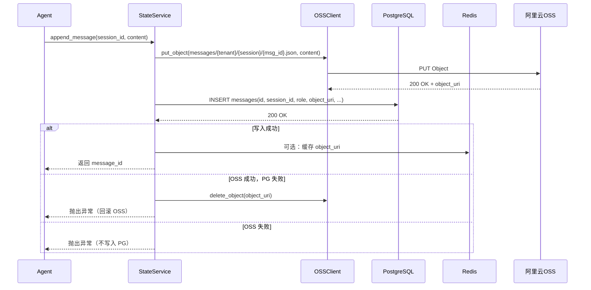
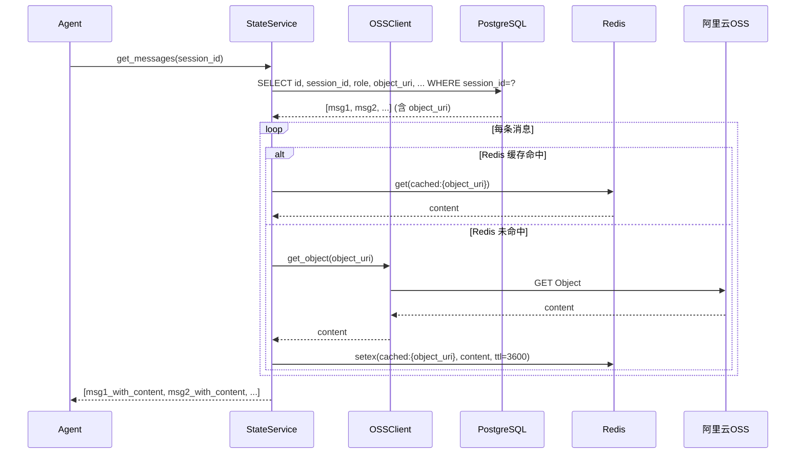
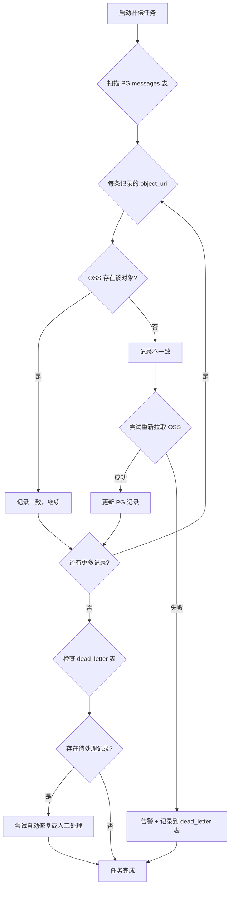

# Arch Design: Remote State Storage — PostgreSQL to OSS Migration

## 文档信息

| 字段 | 内容 |
|------|------|
| 版本 | v0.1 |
| 日期 | 2026-04-27 |
| 状态 | draft |
| 主责角色 | architect |
| 关联 PRD | `docs/artifacts/2026-04-27-remote-state-oss-pivot/prd.md` |
| 关联 Delivery Plan | `docs/artifacts/2026-04-27-remote-state-oss-pivot/delivery-plan.md` |

---

## 1. 系统边界

### 1.1 外部依赖

| 依赖组件 | 用途 | 访问方式 |
|----------|------|----------|
| 阿里云 OSS | Blob 对象存储 | VPC 内网 / 公网（可配置） |
| PostgreSQL | 元数据存储（sessions, messages 元数据, memory 元数据, audit events, configs） | 连接池（PGBouncer 备选） |
| Redis | 缓存（可选，OSS 读取加速） | 连接池 |

### 1.2 边界划分

```
┌─────────────────────────────────────────────────────────────────────┐
│                         调用方（Agent / Gateway）                      │
│                                                                      │
│  RemoteStateStore (state_store.py)                                  │
│  - sessions.append_message(content) → 写入消息内容                    │
│  - memory.upsert_memory(value) → 写入记忆内容                        │
└─────────────────────────────────────────────────────────────────────┘
                                  │
                                  ▼
┌─────────────────────────────────────────────────────────────────────┐
│                        State Service (本次改造目标)                   │
│                                                                      │
│  ┌─────────────────────────────────────────────────────────────┐     │
│  │                    OSSStorageClient                         │     │
│  │  - put_object(bucket, key, content) → object_uri          │     │
│  │  - get_object(object_uri) → content                       │     │
│  │  - delete_object(object_uri) → void                       │     │
│  └─────────────────────────────────────────────────────────────┘     │
│                                  │                                   │
│                                  ▼                                   │
│  ┌─────────────────────────────────────────────────────────────┐     │
│  │                    HybridStoreManager                       │     │
│  │  - write_message(content) → 双写：OSS + PG 元数据          │     │
│  │  - read_message(message_id) → 读 OSS content               │     │
│  │  - write_memory(value) → 双写：OSS + PG 元数据             │     │
│  │  - read_memory(namespace, key) → 读 OSS value              │     │
│  │  - compensation_task() → OSS/PG 不一致检测和修复            │     │
│  └─────────────────────────────────────────────────────────────┘     │
│                                  │                                   │
│          ┌───────────────────────┼───────────────────────┐          │
│          ▼                       ▼                       ▼          │
│  ┌──────────────┐      ┌──────────────┐      ┌──────────────┐     │
│  │  阿里云 OSS  │      │  PostgreSQL  │      │    Redis     │     │
│  │  (Blob 存储) │      │  (元数据)     │      │   (缓存)     │     │
│  └──────────────┘      └──────────────┘      └──────────────┘     │
└─────────────────────────────────────────────────────────────────────┘
```

---

## 2. 组件拆分

### 2.1 新增组件

| 组件 | 职责 | 位置 |
|------|------|------|
| `OSSStorageClient` | OSS 操作封装（上传/下载/删除/列表） | `state_service/storage/oss_client.py` |
| `HybridStoreManager` | 双写逻辑、一致性保障、补偿任务 | `state_service/storage/hybrid_manager.py` |
| `OSSObjectLock` | 审计日志 WORM 存储封装 | `state_service/storage/oss_lock.py` |
| `OSSConfig` | OSS 连接配置（从环境变量/ConfigMap 读取） | `state_service/config.py` |

### 2.2 改造组件

| 组件 | 改造内容 |
|------|----------|
| `StateService` | 注入 HybridStoreManager，移除直接 PG content/value 写入 |
| 数据库 Schema | 迁移脚本：content → object_uri，value → object_uri |

---

## 3. 关键数据流

### 3.1 消息写入流程（双写）



### 3.2 消息读取流程



### 3.3 补偿任务流程



---

## 4. 接口约定

### 4.1 OSS Storage Client 接口

```python
class OSSStorageClient:
    """OSS 操作封装"""

    def put_object(self, bucket: str, key: str, content: bytes | str,
                   metadata: dict | None = None) -> str:
        """
        上传对象到 OSS
        Returns: object_uri (oss://{bucket}/{key} 或 https://{bucket}.{endpoint}/{key})
        """

    def get_object(self, object_uri: str) -> bytes:
        """
        从 OSS 下载对象
        Raises: ObjectNotFoundError
        """

    def delete_object(self, object_uri: str) -> bool:
        """
        删除 OSS 对象（审计日志不应调用此方法）
        Returns: True if deleted, False if not found
        """

    def object_exists(self, object_uri: str) -> bool:
        """检查对象是否存在"""

    def list_objects(self, bucket: str, prefix: str,
                     max_keys: int = 100) -> list[str]:
        """列出 bucket 下指定前缀的对象"""
```

### 4.2 Hybrid Store Manager 接口

```python
class HybridStoreManager:
    """混合存储管理器（双写 + 补偿）"""

    def write_message(self, session_id: str, role: str, content: str,
                      **kwargs) -> int:
        """
        双写消息：先 OSS，再 PG
        Returns: message_id (PG 自增 ID)
        Raises: HybridWriteError
        """

    def read_message(self, message_id: int) -> dict | None:
        """读取单条消息（合并 PG 元数据 + OSS content）"""

    def read_messages(self, session_id: str,
                      limit: int = 50) -> list[dict]:
        """批量读取会话消息"""

    def write_memory(self, namespace: str, key: str, value: str,
                     metadata: dict | None = None) -> dict:
        """
        双写记忆：先 OSS，再 PG
        Returns: memory record dict
        """

    def read_memory(self, namespace: str, key: str) -> dict | None:
        """读取单条记忆（合并 PG 元数据 + OSS value）"""

    def compensation_task(self) -> CompensationResult:
        """
        补偿任务：检测并修复 OSS/PG 不一致
        Returns: {oss_count, pg_count, inconsistency_count, fixed_count}
        """
```

---

## 5. 技术选型

### 5.1 OSS SDK

| 选项 | 推荐度 | 理由 |
|------|--------|------|
| `oss2` (阿里云官方 Python SDK) | ✅ 首选 | 官方支持，内网连接优化，STS Token 支持 |
| `boto3` (S3 兼容 API) | ⚠️ 备选 | 多云场景，MinIO 兼容 |
| `aiobotocore` (异步 boto3) | ❌ 不选 | State Service 目前无异步需求 |

### 5.2 OSS Bucket 配置

```yaml
# messages bucket (标准存储，热数据)
messages-bucket:
  storage_class: Standard
  lifecycle_rule: >90天转 Glacier
  versioning: true  # 保留历史版本

# memory bucket (标准存储，热数据)
memory-bucket:
  storage_class: Standard
  lifecycle_rule: >90天转 Glacier
  versioning: true

# audit bucket (Object Lock, WORM)
audit-bucket:
  storage_class: Standard
  versioning: true
  object_lock: COMPLIANCE  # WORM 保护
  object_lock_days: 2555  # 7年保留期
```

### 5.3 OSS Object Key 规范

```python
# Message content
def message_object_key(tenant_id: str, session_id: str,
                       message_id: int, timestamp: int) -> str:
    return f"messages/{tenant_id}/{session_id}/{message_id}/{timestamp}.json"

# Memory value
def memory_object_key(tenant_id: str, namespace: str,
                      memory_key: str, version: int) -> str:
    return f"memory/{tenant_id}/{namespace}/{memory_key}/{version}.json"

# Audit event (WORM 存储，不可删除)
def audit_object_key(tenant_id: str, event_id: str,
                      timestamp: int) -> str:
    return f"audit/{tenant_id}/{event_id}/{timestamp}.json"
```

### 5.4 PostgreSQL Schema 变更

```sql
-- 迁移前
CREATE TABLE state_messages (
    id BIGSERIAL PRIMARY KEY,
    session_id VARCHAR(64) NOT NULL,
    role VARCHAR(32) NOT NULL,
    content TEXT,  -- 待移除
    token_count INTEGER,
    ...
);

-- 迁移后
CREATE TABLE state_messages (
    id BIGSERIAL PRIMARY KEY,
    session_id VARCHAR(64) NOT NULL,
    role VARCHAR(32) NOT NULL,
    content TEXT,  -- 保留，迁移期间双写，迁移完成后可置空
    object_uri VARCHAR(512),  -- 新增：OSS URI
    oss_version_id VARCHAR(128),  -- 新增：OSS 版本 ID（用于版本控制）
    content_size BIGINT,  -- 新增：content 大小（bytes），便于监控
    ...
);

-- 迁移后索引
CREATE INDEX idx_messages_session_time ON state_messages(session_id, created_at);
CREATE INDEX idx_messages_object_uri ON state_messages(object_uri) WHERE object_uri IS NOT NULL;

-- 记忆表类似变更
CREATE TABLE state_memory (
    id BIGSERIAL PRIMARY KEY,
    namespace VARCHAR(64) NOT NULL,
    memory_key VARCHAR(256) NOT NULL,
    value TEXT,  -- 待移除
    object_uri VARCHAR(512),  -- 新增
    ...
    UNIQUE (namespace, memory_key)
);
```

---

## 6. 一致性保障

### 6.1 双写一致性

**策略**：两阶段写入 + 最终一致性补偿

| 阶段 | 操作 | 失败处理 |
|------|------|----------|
| 1. OSS 写入 | put_object → 获取 object_uri | 抛出异常，不写 PG |
| 2. PG 写入 | INSERT messages(object_uri, ...) | 回滚 OSS（delete_object） |

**幂等性**：使用 message_id 作为 OSS object key 的一部分，保证同一 message 多次写入产生同一 object（覆盖写）。

### 6.2 读取一致性

**策略**：优先读 OSS，PG 作为 fallback

```python
def read_message(message_id: int) -> dict | None:
    # 1. 从 PG 获取 object_uri
    record = pg.query("SELECT object_uri FROM messages WHERE id=?", message_id)
    if not record:
        return None

    # 2. 尝试读 OSS
    try:
        content = oss.get_object(record.object_uri)
        return {**record, "content": content}
    except ObjectNotFoundError:
        # 3. OSS 对象不存在，fallback 到 PG content（迁移期间可能）
        if record.content:
            return {**record, "content": record.content}
        raise
```

### 6.3 补偿任务

**执行频率**：每 5 分钟执行一次

**检测逻辑**：
```sql
-- 找出 PG 有 object_uri 但 OSS 不存在的记录
SELECT m.* FROM state_messages m
WHERE m.object_uri IS NOT NULL
AND NOT oss_exists(m.object_uri);

-- 找出 PG 有 object_uri 但 content 也有值的记录（迁移中状态）
SELECT m.* FROM state_messages m
WHERE m.object_uri IS NOT NULL
AND m.content IS NOT NULL
AND length(m.content) > 0;  -- 双写期间两者都有值
```

**修复策略**：
1. OSS 不存在 → 告警 + 尝试从 PG content 重建 OSS
2. OSS 存在但 PG content 也有值 → 同步完成后清理 PG content

---

## 7. 审计日志 WORM 存储

### 7.1 Object Lock 配置

```python
# 创建带 Object Lock 的 bucket（需要先创建 bucket，再配置 Object Lock）
import oss2

# 方式 1：创建 bucket 时启用 Object Lock
bucket = oss2 Bucket(oss2.Auth(access_key_id, access_key_secret), endpoint, bucket_name)
bucket.create_bucket(oss2.models.BucketConfig(
    storage_class=oss2.BUCKET_STORAGE_STANDARD,
    data_redundancy_type=oss2.BUCKET_DATA_REDUNDANCY_ZRS
))

# 方式 2：Put Bucket Object Lock Configuration（bucket 需支持）
bucket.put_object_lock_configuration(oss2.models.ObjectLockConfiguration(
    object_lock_mode='COMPLIANCE',  # WORM 模式
    object_lock_retention_days=2555  # 7年保留
))
```

### 7.2 审计日志写入

```python
def write_audit_event(event: dict) -> str:
    """
    写入审计日志到 OSS，使用 Object Lock 保护
    - 写入后任何人无法删除或覆盖
    - 保留期 7 年
    """
    object_key = audit_object_key(
        tenant_id=event["tenant_id"],
        event_id=event["event_id"],
        timestamp=event["timestamp"]
    )

    # 直接写入 OSS，不经过 PG（审计日志无需 PG 元数据）
    object_uri = oss_client.put_object(
        bucket="audit-bucket",
        key=object_key,
        content=json.dumps(event),
        metadata={
            "x-oss-object-lock-mode": "COMPLIANCE",
            "x-oss-object-lock-retention-days": "2555"
        }
    )
    return object_uri
```

---

## 8. 监控与告警

### 8.1 关键指标

| 指标 | 类型 | 采集方式 | 告警阈值 |
|------|------|----------|----------|
| oss_write_success_rate | Gauge | 应用埋点 | < 99.9% |
| oss_read_success_rate | Gauge | 应用埋点 | < 99.9% |
| oss_write_latency_p99 | Histogram | 应用埋点 | > 200ms |
| oss_read_latency_p99 | Histogram | 应用埋点 | > 500ms |
| hybrid_inconsistency_count | Gauge | 补偿任务 | > 0 |
| oss_storage_total_bytes | Gauge | OSS API | 增长 > 20%/天 |
| dead_letter_count | Gauge | 补偿任务 | > 10 |

### 8.2 告警配置

```yaml
# Prometheus alert rules
- alert: OSSWriteFailureRateHigh
  expr: oss_write_success_rate < 0.999
  for: 5m
  labels:
    severity: critical
  annotations:
    summary: "OSS 写入失败率高于 0.1%"

- alert: HybridDataInconsistency
  expr: hybrid_inconsistency_count > 0
  for: 1m
  labels:
    severity: warning
  annotations:
    summary: "检测到 OSS/PG 数据不一致"
```

---

## 9. 风险与约束

### 9.1 技术风险

| 风险 | 影响 | 缓解措施 |
|------|------|----------|
| OSS 访问延迟高于 PG | 读取延迟增加 50-100ms | Redis 缓存 + 优先内网访问 |
| 双写期间数据不一致 | 迁移窗口内可能出现不一致 | 补偿任务 + 告警 |
| OSS bucket 配额超限 | 无法写入新对象 | 监控 + 提前扩容 |
| Object Lock 配置错误 | 审计日志无法写入 | 预发布环境验证 |

### 9.2 上线前必须解决的约束

| 约束 | 验证方式 |
|------|----------|
| 阿里云 OSS AccessKey 配置正确 | 预发布环境写入/读取测试 |
| OSS bucket Object Lock 已启用 | API 验证 bucket 配置 |
| OSS 内网 VPC 配置正确 | 同 VPC 下读写测试 |
| PG 迁移脚本在测试环境验证 | 预发布环境执行 + 数据对比 |
| 补偿任务在测试环境验证 | 模拟不一致场景 + 验证修复 |

---

## 10. 兼容性

### 10.1 向后兼容

**目标**：现有 Agent / Gateway 代码无需改动

```python
# RemoteStateStore 接口不变
class RemoteStateStore:
    def append_message(self, session_id: str, role: str, content: str, ...):
        # 内部调用 hybrid_store.write_message()
        # 但返回格式与原来完全一致
        pass
```

### 10.2 PG/OSS 双读兼容（迁移期间）

```python
# 迁移期间允许两种读取路径
def get_content(record: dict) -> str:
    # 优先读 OSS
    if record.object_uri:
        try:
            return oss.get_object(record.object_uri)
        except ObjectNotFoundError:
            pass
    # Fallback 到 PG content（迁移完成后可移除）
    if record.content:
        return record.content
    raise ContentNotFoundError()
```

### 10.3 迁移完成后的清理

| 阶段 | 操作 |
|------|------|
| Phase 3 完成后 | 禁用双写，只写 OSS |
| Phase 4 稳定后 | 清空 PG content 列（保留 object_uri） |
| 6 个月后 | 可考虑移除 PG content 列（ALTER TABLE DROP COLUMN） |

---

## 11. 目录结构

```
state_service/
├── storage/
│   ├── __init__.py
│   ├── oss_client.py        # OSSStorageClient
│   ├── hybrid_manager.py     # HybridStoreManager
│   └── oss_lock.py          # OSSObjectLock (审计日志)
├── migrations/
│   ├── 001_add_object_uri_to_messages.py
│   └── 002_add_object_uri_to_memory.py
└── main.py                  # StateService 入口（改造点）
```
